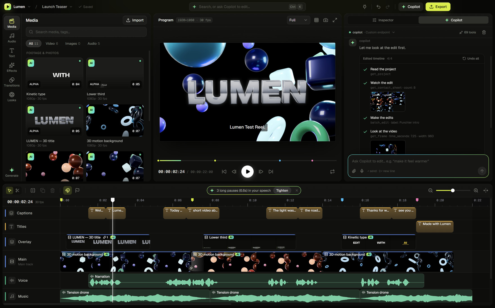
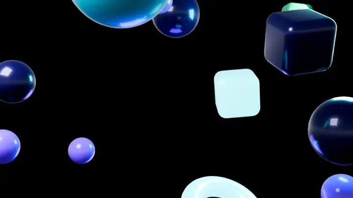
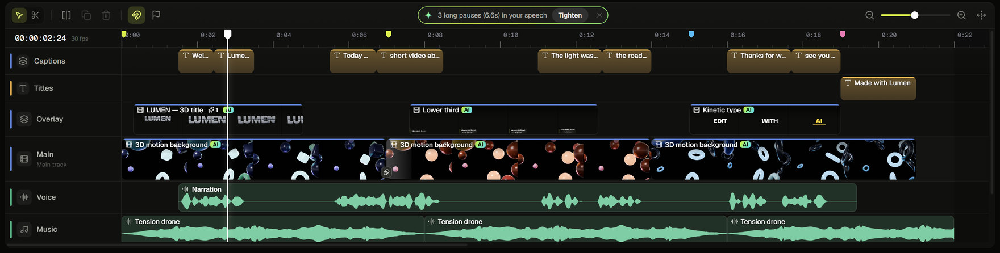
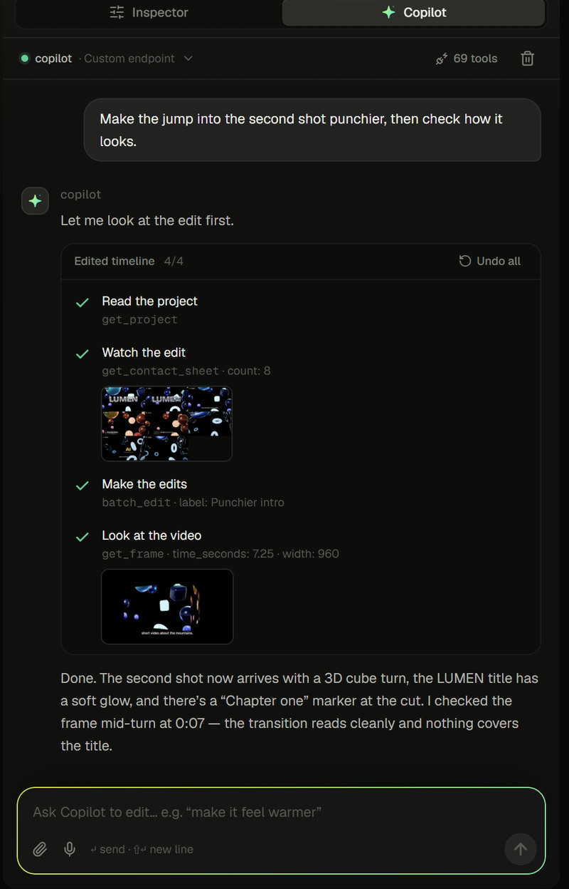
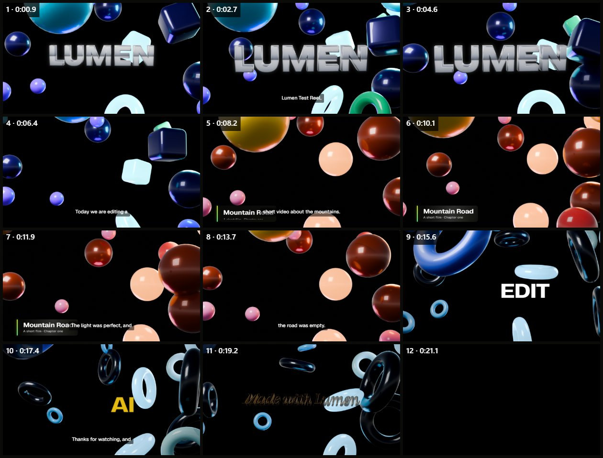
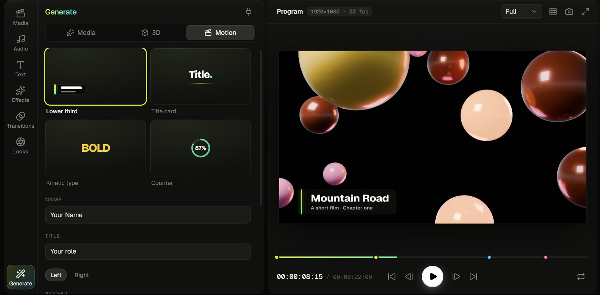
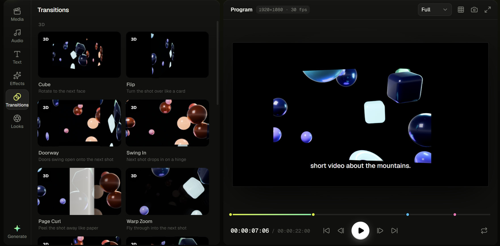
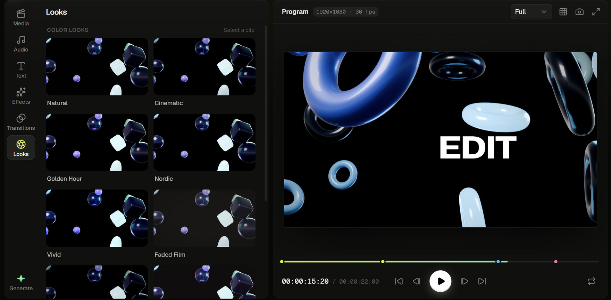
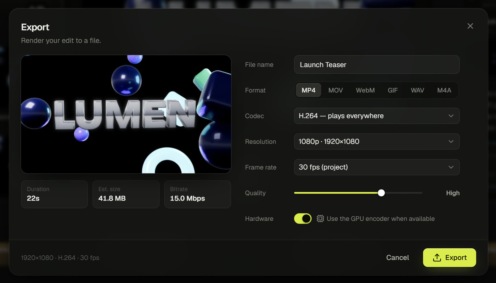
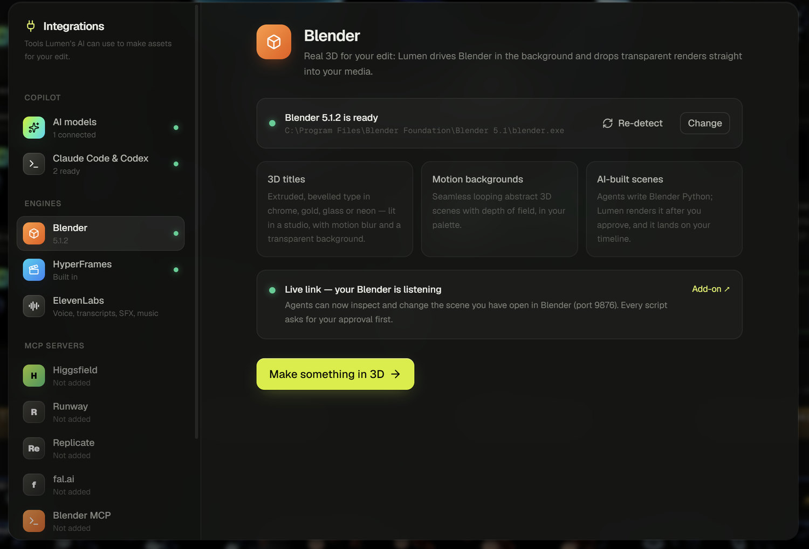

<div align="center">


# Lumen — the open-source AI video editor

**Edit video with an AI that can see, hear and cut.**

<sub>Vibecoded with <b>Claude Opus 5.5</b> by <a href="https://github.com/Mas-inx"><b>Mas-Inx</b></a></sub>

Lumen is a desktop video editor where the AI isn't a chatbot bolted onto a timeline. It watches your edit frame by frame, listens to the mix, reads what's said — and makes real, undoable edits with the same tools you use. Bring your own brain: **Claude Code**, **Codex**, or a model with your **OpenAI, Anthropic, Gemini, OpenRouter** or local **Ollama / LM Studio** key.

[](https://github.com/Mas-inx/lumen-ai-video-editor/releases/latest)
&nbsp;
[](#build-from-source)

[](https://github.com/Mas-inx/lumen-ai-video-editor/releases/latest)
[](https://github.com/Mas-inx/lumen-ai-video-editor/releases)
[](https://github.com/Mas-inx/lumen-ai-video-editor/actions/workflows/ci.yml)


[](#credits)



</div>

## Why Lumen

- **An AI that edits, not just chats.** Every edit in Lumen is a typed command, and the AI gets all of them — plus tools to look and listen. More than 80 tools in all, each change a normal undo step. [See them all →](docs/AI-TOOLS.md)
- **It sees what you'll export.** When the AI checks a frame, it's rendered exactly as the export will be: every track, title, effect and transition. It can watch the whole edit as a contact sheet, look inside footage, and hear loudness, silences and speech.
- **Bring your own brain.** Use the Claude Code or Codex you already pay for, an API key from any major provider, or a local model. Lumen is also an **MCP server**, so any agent can drive it.
- **Local-first.** Media is edited in place and never uploaded. Speech-to-text runs on your GPU with Whisper. No account, no watermark, no telemetry.
- **A real editor underneath.** A magnetic timeline, keyframes, 3D titles and transitions, colour looks, frame-exact export with hardware encoding — so you can finish by hand whatever the AI starts.

It's an open-source alternative to editors like CapCut, Filmora and Descript — built so an AI can do anything you can.

<div align="center">

<br />
<sub>Made in Lumen, frame for frame: Blender backgrounds and a chrome 3D title, HyperFrames motion graphics, Whisper captions, and a 3D cube transition the Copilot added and checked.</sub>
</div>

## Contents

- [Features](#features) — [editing](#a-real-editor) · [Copilot](#the-copilot-sees-hears-and-edits) · [smart edits](#smart-edits) · [generation](#generate-3d-motion-graphics-images-video-and-voice) · [export](#export) · [integrations](#connect-anything)
- [Download](#download) · [Build from source](#build-from-source) · [Documentation](#documentation) · [Roadmap](#roadmap) · [Contributing](#contributing) · [Credits](#credits)

## Features

### A real editor



- **Magnetic main track** that keeps your story edge to edge, with free tracks above and below for B-roll, overlays, titles, captions, voice, music and sound effects.
- Split, trim, ripple, slide into gaps, snapping, markers, speed and reverse, and **keyframes with easing** on every property.
- **Pro editing tools:** roll, slip and slide; ripple trim and insert or overwrite on any track; in and out points to play, lift, extract or export a stretch; copy, cut, paste and *paste attributes*; crop with rounded corners; freeze frames and **speed ramps**; detached sound for J- and L-cuts; groups; and solo and reorder for tracks.
- **2D and 3D transitions** (cube, flip, door, page curl, shatter…), effects, **colour looks and grading**, and extruded **3D titles** rendered live.
- **Real colour grading** on the GPU: tone curves, lift / gamma / gain wheels, HSL by colour range, imported **.cube LUTs**, and **scopes** (waveform, RGB parade, vectorscope, histogram) beside the program monitor.
- **Compositing:** chroma and luma keys with an eyedropper and spill suppression; feathered rectangle and ellipse **masks** you drag on the canvas (on adjustment layers too, to grade just part of the frame); outlined titles in **any font** — imported, or picked from those installed on your computer, and embedded in the project.
- **Sound that drives the picture:** a Web Audio mix with per-clip volume, fades and keyframes, *Studio voice* clean-up, on-device noise reduction and 15 built-in sound effects.
- **A real mixer:** a channel per track and a master bus, each with a fader, pan, a draggable EQ curve, a compressor and a limiter, with live meters. Transitions crossfade the sound too, and exports can be **loudness-normalized** to −14 LUFS for YouTube and Spotify, −16 for Apple, or broadcast's −23 and −24.
- Import **MP4, MOV, WebM, MKV, MP3, WAV, FLAC, PNG, JPEG, WebP, GIF** and more — by dialog, folder or drag and drop. Files stay where they are; missing ones can be relinked.
- `.lumen` **project files** that survive moving folders between drives, crash recovery, and undo for everything. `Ctrl+K` reaches every command.

### The Copilot sees, hears and edits

<table>
<tr>
<td width="46%"></td>
<td>

Ask in plain words — or talk to it. The Copilot plans, uses Lumen's tools, and checks its own work:

| You ask | It… |
| --- | --- |
| “Remove the long pauses and add captions” | transcribes on your GPU, cuts every silence across the whole timeline (captions and B-roll stay in sync), lays timed captions |
| “Make the intro punchier” | watches the edit, adds a 3D transition and a glow in one undo step, renders the frame to check it |
| “Is the music too loud under my voice?” | measures loudness per track in LUFS and ducks the music under speech |
| “Make a vertical version for Reels” | reframes the canvas and every layer to 9:16 |
| “Find where I talk about the mountains” | searches inside transcripts and jumps there |

You see every step, including the frames it looked at, and **Undo all** reverts a whole answer.

</td>
</tr>
</table>

What the AI sees when it watches your edit — one call to `get_contact_sheet`:



**Brains:** your own **Claude Code** or **Codex** (Lumen runs them headless, with only Lumen's tools), or a model with your key: **Anthropic, OpenAI, Google Gemini, OpenRouter, OpenCode Zen, OpenCode Go, Ollama, LM Studio** or any OpenAI-compatible endpoint. Pick the model and the **effort** — how hard it thinks, from Low to Max (Ultra on Codex) — for every one of them, Claude Code's Fable, Opus, Sonnet and Haiku and Codex's own model list included. Keys are encrypted by Windows (DPAPI) and never leave the app's main process.

### Smart edits

One-click suggestions on the timeline, and tools for every AI:

- **Transcribe** on the device with Whisper (GPU via WebGPU, or CPU), or with OpenAI or ElevenLabs.
- **Remove pauses** — the whole timeline closes up around each cut, so captions, B-roll and markers stay in sync while music plays on; with several speakers it only cuts where everyone is quiet.
- **Captions** from the transcript, on their own track.
- **Duck music** under speech with volume keyframes.
- **Reframe** between landscape, vertical, square and portrait.
- **Hear the mix** — loudness in LUFS against the −14 streaming target, peaks, clipping and silences.

### Generate 3D, motion graphics, images, video and voice



- **Blender** — real extruded 3D titles, looping abstract backgrounds and AI-written scenes, rendered in the background and dropped into your media.
- **HyperFrames** motion graphics — lower thirds, title cards, kinetic type, stat counters or any HTML + GSAP composition — rendered inside Lumen.
- **Images and video** from your OpenAI key (GPT Image) or Gemini key (Gemini image models, Veo video), with model lists fetched live — new models show up without an update.
- **Voiceovers, sound effects and music** with ElevenLabs.
- Anything from an **MCP server** — Higgsfield, Runway, Replicate, fal.ai or your own.

### Effects, transitions and looks

 

2D and 3D transitions, 15 effects (glow, grain, shake, RGB split, 3D tilt, curved screen…), one-click colour looks and full grading — each previewed on your own footage before you apply it.

### Export



| Format | Codecs |
| --- | --- |
| MP4 | H.264, HEVC, AV1 |
| MOV | H.264, HEVC |
| WebM | VP9, AV1 |
| GIF | animated, palette-optimised |
| WAV · M4A | audio only |

From 480p to 4K in your project's shape, 24–60 fps, with **hardware encoding** where your GPU supports it, a live file-size estimate and progress in the taskbar.

### Connect anything



- **Lumen is an MCP server.** Turn it on and any agent — Claude Code, Claude Desktop, your own — gets the same 80-plus tools, pictures included:

  ```bash
  claude mcp add --transport http lumen http://127.0.0.1:47910/mcp --header "Authorization: Bearer <token from Lumen>"
  ```

- **Lumen is an MCP client.** Add any server by URL or command; generator tools show up as models in the Generate panel.

## Download

**[Download the latest Lumen for Windows →](https://github.com/Mas-inx/lumen-ai-video-editor/releases/latest)**

Windows 10 or 11, 64-bit. The installer lets you install just for yourself (no admin needed) or for everyone, and associates `.lumen` project files.

Lumen keeps itself up to date: it checks the Releases page, downloads a new version in the background and installs it when you restart (or choose **Check for updates** in the Lumen menu).

> [!NOTE]
> The installer isn't code-signed yet, so Windows SmartScreen may say *“Windows protected your PC”*. Choose **More info → Run anyway**. Every release lists SHA-256 checksums.

Optional: [Blender](https://www.blender.org/download/) 4.2+ for 3D renders. Everything else is built in; the Whisper speech model downloads once (about 200 MB) the first time you transcribe on your device.

## Build from source

You need Windows 10/11 and [Node.js](https://nodejs.org/) 24.

```bash
git clone https://github.com/Mas-inx/lumen-ai-video-editor.git
cd lumen-ai-video-editor
npm install
npm run dev      # the app, with hot reload
```

| Command | What it does |
| --- | --- |
| `npm run dev` | Electron app with hot reload |
| `npm run dev:web` | The UI in a browser tab (no desktop features) |
| `npm test` | Unit tests (Vitest) |
| `npm run typecheck` | TypeScript, renderer and main process |
| `npm run dist` | Windows installer in `release/` |

## Documentation

- [AI tools reference](docs/AI-TOOLS.md) — every tool the AI can use, with parameters
- [Architecture](docs/ARCHITECTURE.md) — how the editor, media engine, AI and integrations fit together
- [Contributing](CONTRIBUTING.md) · [Changelog](CHANGELOG.md) · [Security](SECURITY.md) · [Third-party notices](THIRD-PARTY-NOTICES.md)

<details>
<summary><b>Keyboard shortcuts</b></summary>

| Keys | Action |
| --- | --- |
| `Space` · `J K L` | Play / pause · shuttle |
| `←` `→` · `↑` `↓` | Frame step · previous / next edit point |
| `S` · `Del` · `Shift+Del` | Split · delete · ripple delete |
| `V` · `B` · `N` · `M` | Select tool · blade · snapping · marker |
| `R` · `Y` · `U` | Roll · slip · slide tools |
| `I` · `O` · `X` · `Alt+X` | Mark in · out · around the selection · clear |
| `Shift+Space` · `;` · `'` | Play in to out · lift · extract |
| `Ctrl+C` · `Ctrl+X` · `Ctrl+V` · `Ctrl+Alt+V` | Copy · cut · paste · paste attributes |
| `Shift+F` · `Ctrl+L` · `Ctrl+G` | Freeze frame · detach audio · group |
| `Ctrl+Shift+D` | Crossfade with the clip before |
| Drag + `Ctrl` · `Shift` | Insert · overwrite (on a trim handle, `Ctrl` ripples) |
| `=` `-` · `Shift+Z` | Zoom · zoom to fit |
| `Ctrl+Z` · `Ctrl+Shift+Z` | Undo · redo |
| `Ctrl+I` · `Ctrl+E` · `Ctrl+S` · `Ctrl+O` | Import · export · save · open |
| `Ctrl+K` · `Ctrl+J` · `?` | Command palette · Copilot · all shortcuts |

</details>

## Roadmap

Ideas the project is heading towards — contributions welcome:

- [ ] macOS and Linux builds
- [ ] Code-signed installer
- [ ] Render queues
- [ ] Streaming audio for hour-long recordings
- [ ] More languages for the interface

## Contributing

Bug reports, ideas and pull requests are welcome — start with [CONTRIBUTING.md](CONTRIBUTING.md). Every edit in Lumen is a command in [`src/editor/commands.ts`](src/editor/commands.ts), and every AI tool lives in [`src/integrations/tools/`](src/integrations/tools), so adding a feature for people usually adds it for the AI too.

## Credits

Lumen was vibecoded with **[Claude Opus 5.5](https://www.anthropic.com/claude)** in [Claude Code](https://claude.com/claude-code) by **[Mas-Inx](https://github.com/Mas-inx)**.

## License

[MIT](LICENSE) © 2026 Mas-Inx. Lumen builds on excellent open-source work — see [THIRD-PARTY-NOTICES.md](THIRD-PARTY-NOTICES.md).
